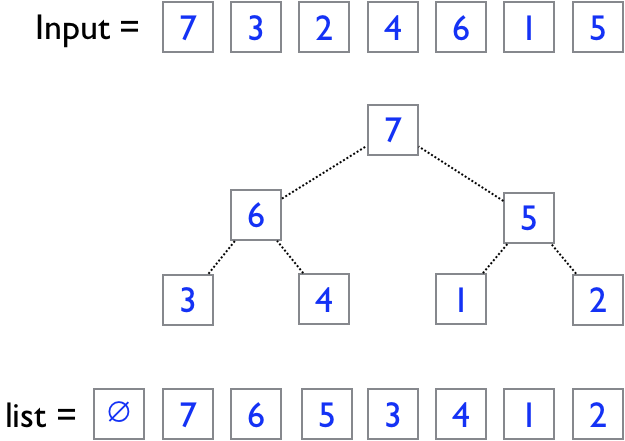

# Priority Queues

## Contents

* [Abstract Priority Queue](#abstract-priority-queue).
* [Lazy Priority Queue](#lazy-priority-queue).
* [Eager Priority Queue](#eager-priority-queue).
* [Binary Heap](#binary-heap).
* [Unit Tests](#unit-tests).
* [References](#references).

---

## Abstract Priority Queue

Source: [`AbstractPriorityQueue.java`](../src/main/java/edu/emory/cs/queue/AbstractPriorityQueue.java)

```java
public abstract class AbstractPriorityQueue<T extends Comparable<T>> {
    protected Comparator<T> comparator;

    public AbstractPriorityQueue(Comparator<T> comparator) {
        this.comparator = comparator;
    }
```

* Class types: `class` vs. `abstract class` vs. `interface`.
* Generics: `<T extends Comparable<T>>`.
* Member types: `private` vs. `package` vs. `protected` vs. `public`.
* Constructor: `this`.

---

```java
    /**
     * Adds a comparable key to this queue.
     * @param key the comparable key.
     */
    abstract public void add(T key);

    /**
     * Removes the key with the highest priority if exists.
     * @return the key with the highest priority if exists; otherwise, {@code null}.
     */
    abstract protected T remove();

    /** @return the size of this queue. */
    abstract public int size();

    /** @return {@code true} if the queue is empty; otherwise, {@code false}. */
    public boolean isEmpty() {
        return size() == 0;
    }
```  

* Abstract methods: `add()`, `remove()`, `size()`.
* Regular method: `isEmpty()`.
* Javadoc.

---

## Lazy Priority Queue

Source: [`LazyPriorityQueue.java`](../src/main/java/edu/emory/cs/queue/LazyPriorityQueue.java)

```java
public class LazyPriorityQueue<T extends Comparable<T>> extends AbstractPriorityQueue<T> {
    private List<T> keys;

    public LazyPriorityQueue(Comparator<T> comparator) {
        super(comparator);
        keys = new ArrayList<>();
    }

    public LazyPriorityQueue() {
        this(Comparator.naturalOrder());
    }
```

* Inheritance: `extends AbstractPriorityQueue<T>`.
* Constructors: default vs. parameters, `this` vs. `super`.

---

```java
    /**
     * Adds a key to the back of the list.
     * @param key the comparable key.
     */
    @Override
    public void add(T key) { keys.add(key); }

    /**
     * Finds the key with the highest priority, and removes it from the list.
     * @return the key with the highest priority if exists; otherwise, {@code null}.
     */
    @Override
    protected T remove() {
        if (isEmpty()) return null;
        T max = Collections.max(keys, comparator);
        keys.remove(max);
        return max;
    }

    @Override
    public int size() { return keys.size(); }
```

* Annotation: [`@Override`](https://docs.oracle.com/en/java/javase/12/docs/api/java.base/java/lang/Override.html).
* Edge case handling: `remove()`.
* Standard API: [`Collections.max()`](https://docs.oracle.com/en/java/javase/12/docs/api/java.base/java/util/Collections.html#max(java.util.Collection,java.util.Comparator)).
* Complexity: `add()`, `remove()`.

---

## Eager Priority Queue

Source: [`EagerPriorityQueue.java`](../src/main/java/edu/emory/cs/queue/EagerPriorityQueue.java)

```java
    /**
     * Adds a key to the list according to the priority.
     * @param key the comparable key.
     */
    @Override
    public void add(T key) {
        int index = Collections.binarySearch(keys, key, comparator);
        if (index < 0) index = -(index + 1);
        keys.add(index, key);
    }

    /**
     * Remove the last key in the list.
     * @return the key with the highest priority if exists; otherwise, {@code null}.
     */
    @Override
    protected T remove() {
        return isEmpty() ? null : keys.remove(keys.size() - 1);
    }
```

* Standard API: [Collections.binarySearch()](https://docs.oracle.com/en/java/javase/12/docs/api/java.base/java/util/Collections.html#binarySearch(java.util.List,T,java.util.Comparator)).
* Ternary conditional operator: `condition ? : `.
* Complexity: `add()`, `remove()`.

---

## Binary Heap

### What is a heap?

* A _tree_ where each node has a _higher_ (or equal) priority than its children.
* The tree must be _balanced_ at all time.
* What is a _binary_ heap?

### Operations
* Add: _swim_.
* Remove: _sink_.
* Both operations can be done in _$O(\log n)$_.

---




* Binary heap can be represented by a _list_.
* Index of the parent: _$k/2$_.
* Index of the children: _$k*2$_ and _$(k*2) + 1$_.

---

Source: [`BinaryHeap.java`](../src/main/java/edu/emory/cs/queue/BinaryHeap.java)

```java
public class BinaryHeap<T extends Comparable<T>> extends AbstractPriorityQueue<T> {
    private List<T> keys;

    public BinaryHeap(Comparator<T> comparator) {
        super(comparator);
        keys = new ArrayList<>();
        keys.add(null);    // initialize the first item as null
    }

    public BinaryHeap() {
        this(Comparator.naturalOrder());
    }

    @Override
    public int size() {
        return keys.size() - 1;
    }
```

* Handle the `null` key at the front.

---

```java
    @Override
    public void add(T key) {
        keys.add(key);
        swim(size());
    }

    private void swim(int k) {
        while (1 < k && comparator.compare(keys.get(k / 2), keys.get(k)) < 0) {
            Collections.swap(keys, k / 2, k);
            k /= 2;
        }
    }
```

* Add each key to the end of the list and _swim_ until it becomes a heap.
* `comparator.compare()`: compare itself to its parent.

---

```java
    @Override
    protected T remove() {
        if (isEmpty()) return null;
        Collections.swap(keys, 1, size());
        T max = keys.remove(size());
        sink(1);
        return max;
    }

    private void sink(int k) {
        for (int i = k * 2; i <= size(); k = i, i *= 2) {
            if (i < size() && comparator.compare(keys.get(i), keys.get(i + 1)) < 0) i++;
            if (comparator.compare(keys.get(k), keys.get(i)) >= 0) break;
            Collections.swap(keys, k, i);
        }
    }
```

* Replace the root with the last key in the list and _sink_ until it becomes a heap.
* Compare two children.
* Compare itself to the greater child.

---

## Unit Tests

Source: [`PriorityQueueTest.java`](../src/test/java/edu/emory/cs/queue/PriorityQueueTest.java)

### Accuracy

```java
@Test
public void testAccuracy() {
    testAccuracy(new LazyPriorityQueue<>(), Comparator.reverseOrder());
    testAccuracy(new EagerPriorityQueue<>(), Comparator.reverseOrder());
    testAccuracy(new BinaryHeap<>(), Comparator.reverseOrder());
}

private void testAccuracy(AbstractPriorityQueue<Integer> q, Comparator<Integer> sort) {
    List<Integer> keys = new ArrayList<>(Arrays.asList(4, 1, 3, 2, 5, 6, 8, 3, 4, 7, 5, 9, 7));
    keys.forEach(q::add);
    keys.sort(sort);
    keys.forEach(key -> assertEquals(key, q.remove()));
}
```

* Annotation: `@Test`.

---

### Speed

```java
private void addRuntime(AbstractPriorityQueue<Integer> queue, long[] times, int[] keys) {
    long st, et;

    st = System.currentTimeMillis();

    for (int key : keys)
        queue.add(key);

    et = System.currentTimeMillis();
    times[0] += et - st;

    st = System.currentTimeMillis();

    while (!queue.isEmpty())
        queue.remove();

    et = System.currentTimeMillis();
    times[1] += et - st;
}
```

---

### Speed Comparison - Add


* Lazy: _$O(1)$_ vs. Eager: _$O(\log n)$_? vs. Heap: _$O(\log n)$_.

---

### Speed Comparison - Remove


* Lazy: _$O(n)$_, Eager: _$O(1)$_, Heap: _$O(\log n)$_.

---

## References

* [Priority queue](https://en.wikipedia.org/wiki/Priority_queue).
* [Binary heap](https://en.wikipedia.org/wiki/Binary_heap).
* [Generics in Java](https://en.wikipedia.org/wiki/Generics_in_Java).
