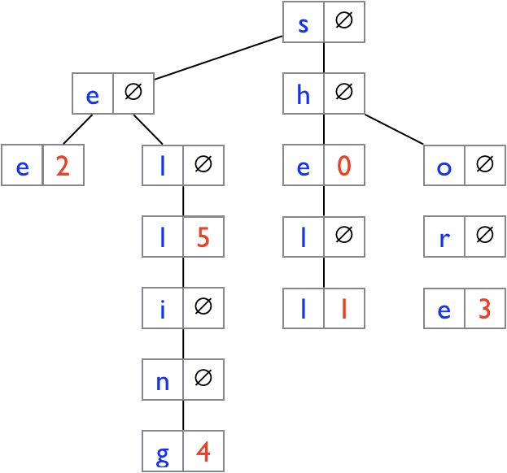
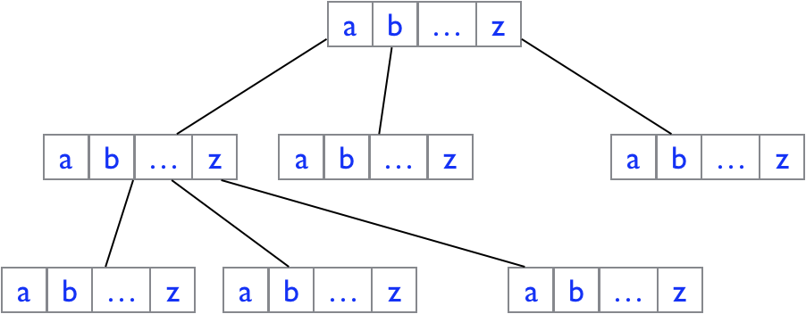

# Tries

## Contents

* [Trie vs. BST](#trie-vs.-bst)
* [Trie Node](#trie-node)
* [Trie](#trie)
* [References](#references)

---

## Trie vs. BST

### String comparisons

```java
{"she", "shell", "see", "shore", "selling", "sell"}
```
* How many character comparisons using a binary search tree or a trie?



---

### Children representation

<br>
<br>

* How many childrens are expected per node?
* What data strucctures to represent childnre?

---

## Trie Node

```java
public class TrieNode<T> {
    private Map<Character, TrieNode<T>> children;
    private TrieNode<T> parent;
    private boolean end_state;
    private char key;
    private T value;

    public TrieNode(TrieNode<T> parent, char key) {
        children = new HashMap<Character, TrieNode<T>>();
        setEndState(false);
        setParent(parent);
        setKey(key);
        setValue(null);
    }
```

* Generic: what is `<T>` for?
* Base API: [HashMap](https://docs.oracle.com/en/java/javase/12/docs/api/java.base/java/util/HashMap.html).
* Member instances: `value` vs. `end_state`.

---

Source: [`TrieNode.java`](../src/main/java/edu/emory/cs/trie/TrieNode.java)

```java
public TrieNode<T> getChild(char key) {
    return children.get(key);
}

public TrieNode<T> addChild(char key) {
    TrieNode<T> child = getChild(key);

    if (child == null) {
        child = new TrieNode<T>(this, key);
        children.put(key, child);
    }

    return child;
}

public TrieNode<T> removeChild(char key) {
    return children.remove(key);
}
```

* Complexities: `get()`, `add()`, `remove()`.

---

## Trie

Source: [`Trie.java`](../src/main/java/edu/emory/cs/trie/Trie.java)

```java
public class Trie<T> {
    private TrieNode<T> root;

    public Trie() {
        root = new TrieNode<>(null, (char) 0);
    }

    public T get(String key) {
        TrieNode<T> node = find(key);
        return (node != null && node.isEndState()) ? node.getValue() : null;
    }

    public TrieNode<T> find(String key) {
        char[] array = key.toCharArray();
        TrieNode<T> node = root;

        for (int i = 0; i < key.length(); i++) {
            node = node.getChild(array[i]);
            if (node == null) return null;
        }

        return node;
    }
```

* Dummay character: `(char)0`.
* Complexity: `find()`.

---

```java
public T put(String key, T value) {
    char[] array = key.toCharArray();
    TrieNode<T> node = root;

    for (int i = 0; i < key.length(); i++)
        node = node.addChild(array[i]);

    node.setEndState(true);
    return node.setValue(value);
}
```

---

```java
public boolean remove(String key) {
    TrieNode<T> node = find(key);

    if (node == null || !node.isEndState())    // node doesn't exist
        return false;

    if (node.hasChildren()) {    // node to be removed as children
        node.setEndState(false);
        return true;
    }

    TrieNode<T> parent = node.getParent();

    while (parent != null) {    // remove iteratively
        parent.removeChild(node.getKey());

        if (parent.hasChildren() || parent.isEndState())   // another word
            break;
        else {
            node = parent;
            parent = parent.getParent();
        }
    }

    return true;
}
```

---

## References

* [Trie](https://en.wikipedia.org/wiki/Trie).
